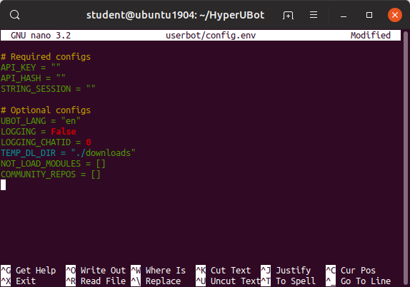
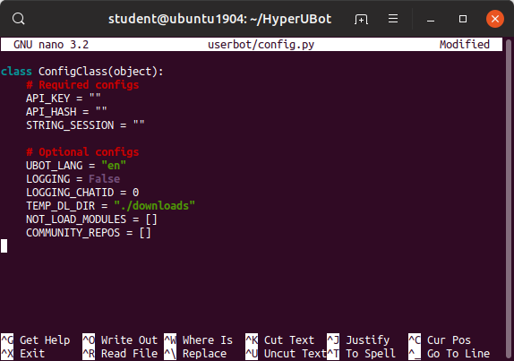
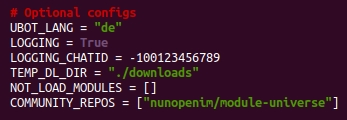

# HyperUBot Guide - Set up in a Debian Based Distro
## 0. Pre-requisites

Before starting up, make sure you have the following packages installed:

- Python
- Git
- Neofetch
- FFmpeg
- FLAC
- NET-3 networking toolkit
- Nano editor

It is required to have at least Python 3.8. To install the following packages, open your Terminal and run the following command:

`sudo apt-get update && sudo apt-get install python3 python3-pip git neofetch ffmpeg flac net-tools nano`

The prefered distros to work are Ubuntu 18.04 and Ubuntu 20.04 (flavours like Kubuntu, Xubuntu and Lubuntu, and variants like Linux Mint, work too!), but other Debian based distros (including Debian itself) should work.

## 1. Download HyperUBot

After having the needed packages installed, you will need to download and extract the bot's package from the GitHub release section.
You can do such with the following commands:

1. `curl -H "Accept: application/json" https://api.github.com/repos/nunopenim/HyperUBot/releases/latest | grep '"tarball_url"' | cut -d '"' -f4 | wget --output-document=HyperUBot.tar.gz -i -`
2. `mkdir HyperUBot` (create a new directory named `HyperUBot`)
3. `tar -xvf HyperUBot.tar.gz --directory HyperUBot --strip-components=1` (extract downloaded package to `HyperUBot` directory)
4. `rm HyperUBot.tar.gz` (delete downloaded package; optional)

If the download and extract went fine you should have a folder named `HyperUBot` in the current working directory with all it's contents in it.

Change the directory to `HyperUBot` by using the following command:

`cd HyperUBot`

## 2. Setup HyperUBot

You can set up HyperUBot using it's own Setup Assistant (recommended) or doing it manually by creating the required configuration file using Nano editor and installing the pip requirements.

### 2.1 HyperUBot's Setup Assistant (recommended for beginners)

The Setup Assistant guides you through all required processes to run HyperUBot properly on your Debian System such as creating the configuration file or installing the pip requirements automatically.
Run the following command to start the Setup Assistant:

`python3 setup.py`


**Jump to Step [3. Running the bot!](#3-running-the-bot) if Setup Assistant was completed successfully**

### 2.2 Setup HyperUBot manually (for advanced users)

To set up HyperUBot manually you need to follow the following steps:

- Installing the required pip packages
- Creating a configuration file (config.env or config.py)
- Generating a String Session using generate_session.py script

### 2.2.1 Installing the pip packages

In HyperUBot's main directory, run the following command:

`python3 -m pip install -r requirements.txt`


This should install all the bot's requirements. After this command is done, and if it ran well, you are ready to advance to #2.2.2.

### 2.2.2 Configuring the bot

The bot relies on a config file, either `.env` or `.py`. You can find the sample configs inside `userbot` directory of HyperUBot.
Sample configs are **NOT** to be used and just serves as demonstration files, with descriptions of the supported fields.
Some modules downloaded from community repos might require you to add extra configuration fields or classes for them to properly work!

### 2.2.3-1 Setup config using ENV

To create a new config `.env` file, run the following command:

`nano userbot/config.env`

This will open the nano text editor, inside you can copy the following template:

```
# Required configs
API_KEY = ""
API_HASH = ""
STRING_SESSION = ""

# Optional configs
UBOT_LANG = "en"
LOGGING = False
LOGGING_CHATID = 0
TEMP_DL_DIR = "./downloads"
NOT_LOAD_MODULES = []
COMMUNITY_REPOS = []
```



### 2.2.3-2 Setup config using py script

To create a new config `.py` file, run the following command:

`nano userbot/config.py`

This will open the nano text editor, inside you can copy the following template:

```python
class ConfigClass(object):
    # Required configs
    API_KEY = ""
    API_HASH = ""
    STRING_SESSION = ""

    # Optional configs
    UBOT_LANG = "en"
    LOGGING = False
    LOGGING_CHATID = 0
    TEMP_DL_DIR = "./downloads"
    NOT_LOAD_MODULES = []
    COMMUNITY_REPOS = []
```




Save it, by doing **CTRL + S** and then **CTRL + X**, to exit the editor.


To get the `API_KEY` and `API_HASH` values, you will need to login to [My Telegram](https://my.telegram.org/).


Here you can create an App, in the API Development Tools page.
After creating an App, your `API_KEY` is the `App api_id` value, and your `API_HASH` is the `App api_hash`.


**Don't share these values with anyone!** By running the same command as before,
to open the text editor, you can copy and paste these values to between the "" in each of these fields.


Note: Only one config file, either `config.env` or `config.py`, should be configured in `userbot` directory.
If both are configured there, then only `config.env` will be loaded.

### 2.2.4 Generating a String Session

We have included, in the root folder of the userbot, a python script to generate a string session.
This is required in order to run HyperUBot properly. To do such, you can run the command:

`python3 generate_session.py`

It will ask you for your phone number and the login code message. After obtaining the String session,
you can copy the value, and the paste it in the `STRING_SESSION` configuration field, between the "", of your previous created config file


### 2.2.5 Logging, Language and Community Repos (optional)

Setting up logging is easy, all you need is a designated log group **(Do not use public groups, or you could be banned for spam!)**.
Having the log group, you need to find it's ID. You can do such by using a Group Manager Bot,
or if your userbot is working already, by the .chatinfo command.
Copy this ID and put it in the `LOGGING_CHATID` field e.g `LOGGING_CHATID = -100123456789`,
then set `LOGGING` config to `True`. That's it!

To set up a language, you will need to change the `UBOT_LANG` config,
to any of the supported languages inside `translations` directory.
Just replace `en` by any other language code (no need to include the .py part of the file).

Community repos are also easy to set up. All you need is the name of the repository and the author,
in GitHub. Then add it, between "", to between the [] in the `COMMUNITY_REPOS` field.
If you need to add more repositories, separate them by commas (for example ["nunopenim/repo1", "nunopenim/repo2"]).



## 3. Running the bot!

If your configuration is valid, and everything has been set-up correctly, you are ready to start!
Do such by running the following command:

`python3 -m userbot`

If you see this message below in terminal

`I: userbot: You're running HyperUBot vX.X.X as [your Telegram name] (ID: 123456789)`

then congratulations! You successfully did setup HyperUBot on your Debian System!


Enjoy HyperUBot and have fun!
